<a href="http://www.chicken-in.com/"></a>

## <a href="http://www.chicken-in.com/">'CHICKEN IN' - RED ROCKS CHARCOAL CHICKEN</a>
### TIMESHEET AND OVERTIME TRACKING SYSTEM

Coder Academy Group Project 2018 by <a href="https://github.com/oheydrew">Drew</a>, <a href="https://github.com/maxitron93/">Maxi</a>, <a href="https://github.com/shunichiroid">Shun</a> and <a href="https://github.com/mcwinter07">Winter</a> - **Team Painframe**

----
<br>

## **What is Chicken-In?**

<a href="http://www.chicken-in.com/">🐔  **"Chicken-In"** 🐔 </a> is a Timesheet and Shift Tracking web app designed specifically to our client's specifications. Employees can log in on a mobile-first site design, and quickly fill out their worked hours, whilst Managers can log in to a full desktop dashboard, where they can review, approve, and get information about the shifts logged. 

Designed to be smooth, seamless and easy to use, **Chicken-In** gets employees *Chicken-In*, and *Chicken-Out*. 🐔 !

----
<br>
<br>

## **Developer Readme**

(We've added some Dev instructions down the Very End of this document: [**Dev instructions**](#dev-instructions) )

## Demo Account Details:

Manager/Employee Logins:

>Username: `demo@redrocks.com`
>
>Password: `password`

The demo account will update React state, but NOT store information to the database.

<br>
<br>

----
<!-- START doctoc generated TOC please keep comment here to allow auto update -->
<!-- DON'T EDIT THIS SECTION, INSTEAD RE-RUN doctoc TO UPDATE -->
**Table of Contents**  *generated with [DocToc](https://github.com/thlorenz/doctoc)*

  - [**Presentation Slides**](#presentation-slides)
  - [**The Client Brief**](#the-client-brief)
      - [**The Problem**](#the-problem)
      - [**The Solution**](#the-solution)
- [**Application Design**](#application-design)
  - [**Concept Review**](#concept-review)
  - [**2-Sided App Functionality**](#2-sided-app-functionality)
      - [**Employee Functionality**](#employee-functionality)
      - [**Manager Functionality**](#manager-functionality)
  - [**User Stories / Journey**](#user-stories--journey)
    - [**User Profiles**](#user-profiles)
    - [**User Stories(Employee)**](#user-storiesemployee)
    - [**User Stories(Manager)**](#user-storiesmanager)
      - [**Link to User Stories Trello Board**](#link-to-user-stories-trello-board)
  - [**Wireframes and UX**](#wireframes-and-ux)
      - [**Design Wireframes**](#design-wireframes)
      - [**Guest Pages**](#guest-pages)
      - [**Employee View**](#employee-view)
      - [**Manager Reports**](#manager-reports)
      - [**Manager Approvals**](#manager-approvals)
      - [**Manager Team Management**](#manager-team-management)
      - [**Manager Settings**](#manager-settings)
      - [**Link to Design Wireframes on Figma**](#link-to-design-wireframes-on-figma)
  - [**Entity Relationship Diagram**](#entity-relationship-diagram)
  - [**Project Architecture**](#project-architecture)
  - [**Overview:**](#overview)
  - [**Additional Architecture Information**](#additional-architecture-information)
- [**Project Management**](#project-management)
  - [**Client Meetings**](#client-meetings)
  - [**Information Gathering and Competitor Analysis**](#information-gathering-and-competitor-analysis)
      - [**Competitor Analysis**](#competitor-analysis)
      - [**Branding Development**](#branding-development)
      - [**Color Development**](#color-development)
  - [**Planning and Scope**](#planning-and-scope)
      - [**Initial Timeline**](#initial-timeline)
      - [**Final Timeline**](#final-timeline)
  - [**Team Management**](#team-management)
    - [**Self Assessment & Pain points**](#self-assessment--pain-points)
      - [**Maxi**](#maxi)
      - [**Drew**](#drew)
      - [**Winter**](#winter)
      - [**Shun**](#shun)
  - [**Agile Methodology**](#agile-methodology)
  - [Agile Methodology](#agile-methodology)
    - [Agile Practices Included:](#agile-practices-included)
    - [Ideation](#ideation)
    - [StandUps](#standups)
    - [Blocked / Review](#blocked--review)
  - [**Code review**](#code-review)
  - [**Git Workflow**](#git-workflow)
    - [Git Workflow](#git-workflow)
  - [**Client Handover and Continued Support**](#client-handover-and-continued-support)
  - [**Client Questionaire**](#client-questionaire)
  - [**Post Project Review**](#post-project-review)
      - [**Testing**](#testing)
- [**Tools & Methodologies**](#tools--methodologies)
  - [**Project Management Tools**](#project-management-tools)
      - [**Figma**](#figma)
      - [**Trello**](#trello)
      - [**Git**](#git)
- [Future Development](#future-development)
  - [Features](#features)
  - [Handover](#handover)
  - [**Dev instructions**](#dev-instructions)
      - [Required Pre Installation:](#required-pre-installation)
      - [Clone and NPM Install](#clone-and-npm-install)
      - [To run the server in Development mode:](#to-run-the-server-in-development-mode)
      - [Step 1 (.env):](#step-1-env)
      - [Step 2 (hostUrl):](#step-2-hosturl)

<!-- END doctoc generated TOC please keep comment here to allow auto update -->

----

## **Presentation Slides**

<a href="http://www.chicken-in.com/">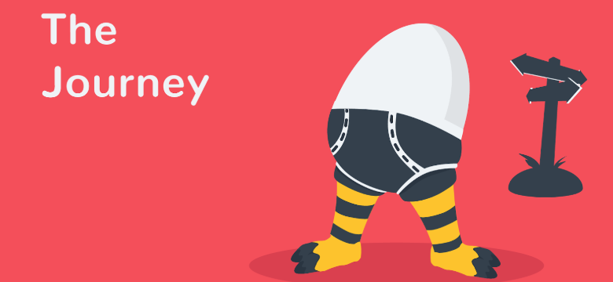</a>

<a href="https://github.com/mcwinter07">Winter</a> did an amazing job of the design for this project, as well as fully custom slides for our presentation. They're worth a look, if nothing else for a chuckle! The slides can be found <a href="https://docs.google.com/presentation/d/1yRALAbHxcgRqda7y49eGluFWrTfLYAJHStM54W8S0aE/edit?usp=sharing">HERE</a>

----

<<<<<<< HEAD
#### **The Client Brief**
=======
## **The Client Brief**
>>>>>>> 3852b8b5c58d605f454929488cbe80a857e994e4

Our client, Edwin Huang, owns and operates a number of charcoal chicken shops around Victoria, under the brand name **“Red Rocks Charcoal Chicken”**. He splits his time between working in the stores as a manager, and doing all the administrative/entrepreneurial work as the owner.

Red Rocks Charcoal Chicken is a small group of chicken shops all owned by the same owner. They aren't a franchise, more a small group owned by the same group. A lot of their regular employees are students, and as they aren't a very technologically invested company, they are still doing their time-sheets and overtime calculations manually. 

Red Rocks Charcoal Chicken have little to no branding (Besides the colours Red and White and various "chicken" mascot logos) to speak of, and almost no internet presence, so we did not have to worry about linking into an existing system. This was a challenge but also provided us with an opportunity to work on branding and style.

#### **The Problem**

One of our client's most significant challenges is keeping track of employee hours worked, calculating overtime and calculating how much he owes in wages to each employee. Currently, his employees record how many hours they’ve worked on a paper form, and he manually updates his excel spreadsheet at the end of the week. It’s time-consuming work, and his employees often make mistakes which means he has to follow up with each employee if there are any discrepancies in the shifts they've logged.

#### **The Solution**

We saw a lot of potential for being able to help him with his business needs- He suggested we could develop him a front-facing website that his clients could use to look up their locations and menus, but we felt that it wouldn't suit the scope of our project. In the end due to time and scope constraints, we decided with Edwin to work on a small app to take track of weekly hours worked by his staff, and calculate the number of overtime hours. 

Big considerations in this project are the differences in the ways in which different users will use the product. **Employees** will likely wish for a simple, quick, easy interaction with the software, *most likely on their mobile phones*. **Managers**, however, will want a lot more control, data display and interactivity with their end of the process. 

In both cases, the aim of this project will be to *help both the employees, and the managers, spend less time on the administrative chores of timesheets*. The mobile app for Employees, will need to be simple, responsive, and easy to use- and the app for the managers will need to do a lot of automatic calculation, organization and filtering, to make the managers' jobs easier and simpler. This is about giving them something they will *want* to use, not something that scares them away from the technology.

<br>


# **Application Design** 
<a href="./docs/part-b/images/project-divider2.png" target="_blank">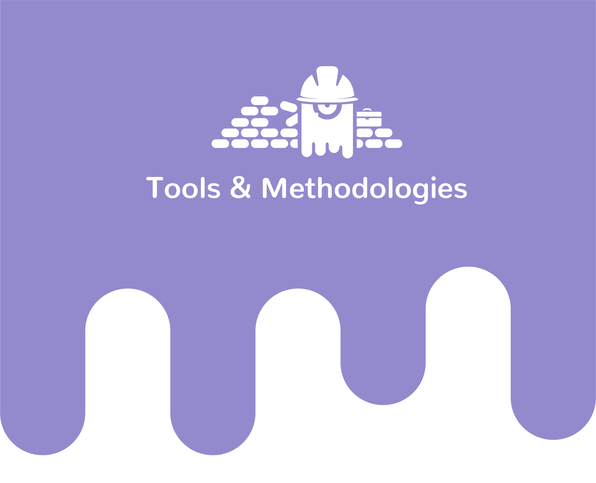</a>

## **Concept Review**

We had our first meeting with the client, Ed, on July 5, when we discussed the web-app's requirements. Ed gave us an overview of the functionality he would like the app to have, incuding having the ability to:

- Approve or reject shift submissions
- View a summary of all the shifts by week
- Automatically calculate the pay based on the hours worked and day worked
- Add or remove employees from the system

We also proposed some ideas, including developing for mobile first, and creating a user-friendly interface for his employees. We built our app based on the requirements discussed in this meeting since the concept didn't change much throughout the development process.


## **2-Sided App Functionality**

#### **Employee Functionality**

Addressing a key consideration from our client, we decided to implement a mobile-first approach for the employee facing app, where each user is able to log in, enter, track, and view the total standard/overtime/double time hours of each shift input. 

We found that this stripped back interface would best serve the needs of the client's team, who found their paper-based system inefficient and time-consuming.

In the **Employee** section, the app allows employees to log in, enter their shifts, and the app automatically calculates the standard and overtime hours based on the information. The app then sends this information back to our mongodb database for later retrieval by the **Manager** side of the app. The Employee is also able to see the status of their entered shifts, from *pending*, to *approved* and *rejected*. 

This app has 2 main views (pages):
- Add Shift
- Employee Settings (Update password, etc)

#### **Manager Functionality**

On successful manager login, the user is redirected to the manager dashboard, where they have access to several core functions of the app.

In the **Manager** section, Ed or his managers, can add/remove employees from the system and review the submissions before *approving* them. The dashboard will also include an overview of past wages paid, which he filters by various fields (dates, locations, employee, etc).

This section has 5 main views (pages):
- Reporting / Filtering past shifts
- Data Visualization
- Review/Approval
- Team Management
- Business Settings (ie overtime rates, store locations etc)

After our initial meeting with the client, our team decided that we could not integrate mobile-first design for the manager dashboard without sacrificing the ability to display and easily read shift data. As such, the manager dashboard focuses on desktop functionality, with mobile-driven added in by converting all shifts to "cards". This is a difficult way to use the app, but is still possible.

<br>

## **User Stories / Journey**

### **User Profiles**
We focussed on providing a number of basic user profiles based on the types of users we are likely to encounter. We were informed there are a number of students and graduates who are employed in the shops, and the managers vary in age, the youngest being 24. From this, we created some basic profiles, and decided to focus on how the app may be used rather than fleshing out too many details about the characters.


### **User Stories(Employee)**
Employee user stories helped us to really understand that the employee will be looking for a fast, quick, easy option. Nobody likes waiting around after their shift to fill in paperwork, and nobody wants many details stored on our service. Quick login, with a quick entry of shifts, and that's that. They're likely to be on mobile, so this will be a mobile first approach.

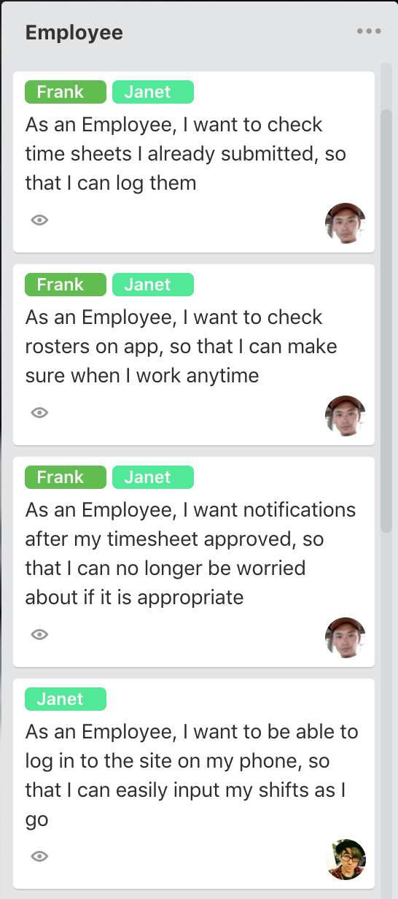

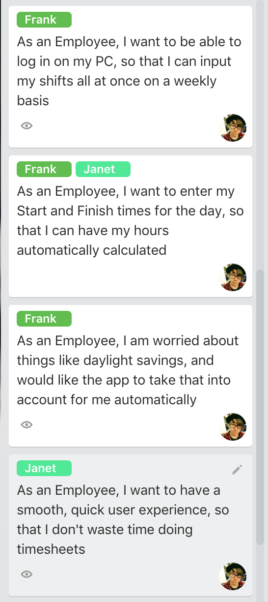

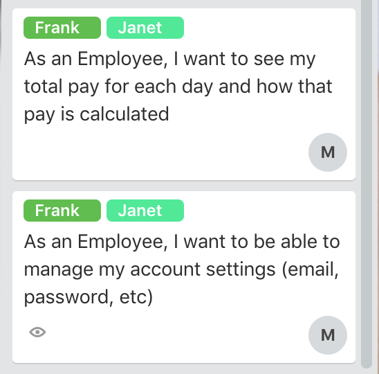

### **User Stories(Manager)**
This was where we realised the bulk of our app's features would take place. The main "employer" section requires us to make multiple pages for administration as well as information the employer can get out of the app. In the future, we'd love to add exporting/ integration into business management software, but for now we decided to focus on a "dashboard", web version first.

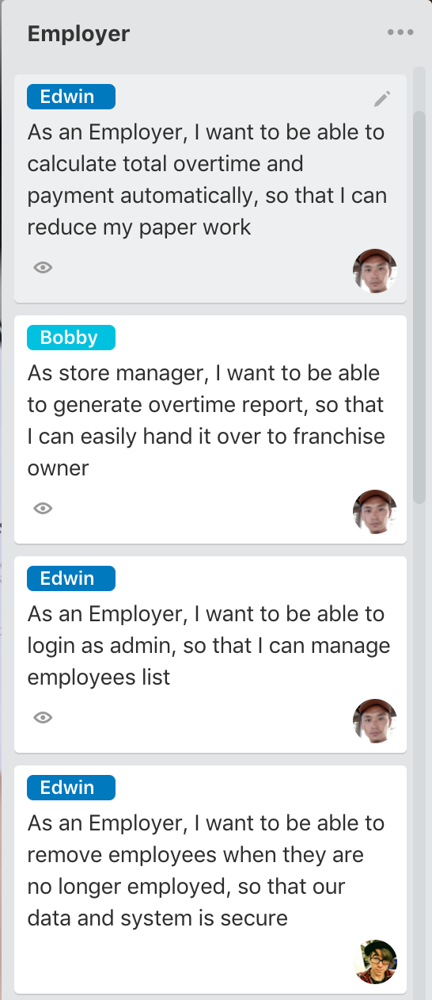

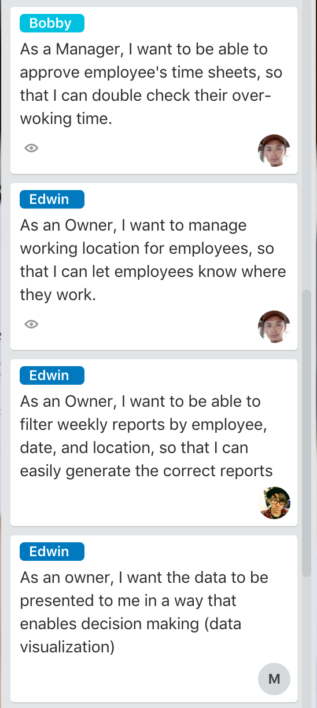

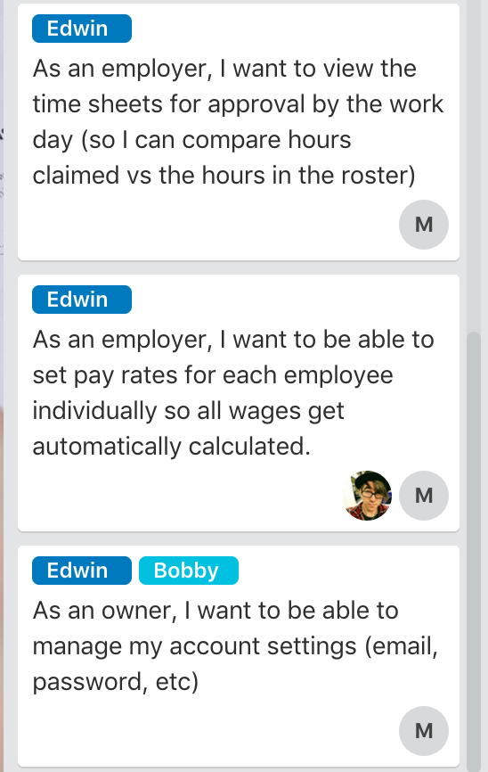

#### **Link to User Stories Trello Board**
You can find the full list of our insights and user stories <a href="https://trello.com/b/1kl5tgnk">HERE</a>!

<br>

## **Wireframes and UX**

We initially came together to make a first pass wireframe- which we won't inflict on you in this document, but feel free to click the link and have a look:

Link To: **[First Pass Wireframes on Figma](https://www.figma.com/file/gQQXmtltA663KtTEjNjUGpPT/Wireframe)**

#### **Design Wireframes**

**You can find our beautiful, Final Design Wireframes on Figma <a href="https://www.figma.com/file/E6dEYafb0SWYjyU57uw4HRga/Chicken-in-Design">HERE</a>**
<br>

To create our initial wireframe we used the insights gained through our user stories to rapidly prototype our apps features and general design. From there, we moved on to more specific design wireframes, which can be seen below:

#### **Guest Pages**

We decided to implement a mobile-first design for our guest and employee login pages as they would be the most frequent users of the Chicken-in Web app. The single page design allows the users to rapidly digest the purpose of the app with a summary of its full functionality in the about section.

<a href="./docs/part-b/images/guest-loginPage.png" target="_blank">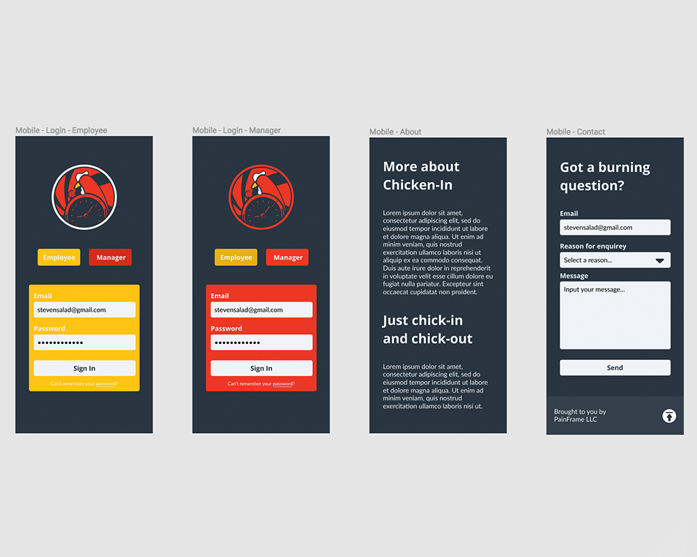</a>

<br>

#### **Employee View**

Iterating on the single page design, Red Rocks employees are redirected to a lightweight rostering app with the immediate ability to add and review past/pending/rejected shifts.

<a href="./docs/part-b/images/employee-pages.png" target="_blank"></a>

<br>

#### **Manager Reports**

On this page, the manager is given an overview of the weekly shifts that have been approved or are pending approval. A stretch goal is to integrate a "print report" function that produces a print ready pdf for physical documentation. An additional consideration is to include data visualisation within this dashboard further support the reporting functionality.

<a href="./docs/part-b/images/manager-reports.png" target="_blank"></a>

<br>

#### **Manager Approvals**

On this page, managers have the ability to view all pending shifts input from employees and approve/reject them. Stretch goals are to include a comment popup when rejecting a shift to give further clarification to an employee as to why the shift has been denied.

<a href="./docs/part-b/images/manager-approvals.png" target="_blank"></a>

<br>

#### **Manager Team Management**

We decided that a full-scale HR app that stored and protected large amounts of employee data was not necessary for our client scale. Designed for ease of use, we kept the interface lean, with the ability to quickly edit, remove (archive), and add new employees within one view.

<a href="./docs/part-b/images/manager-teamManagement-newEmp.png" target="_blank"></a>

<br>

#### **Manager Settings**

Rather than hard code the values for overtime and double time, we decided to give our client the option to change the multiplier according to the current award rate in hospitality, as this is prone to change.


<a href="./docs/part-b/images/manager-settings.png" target="_blank">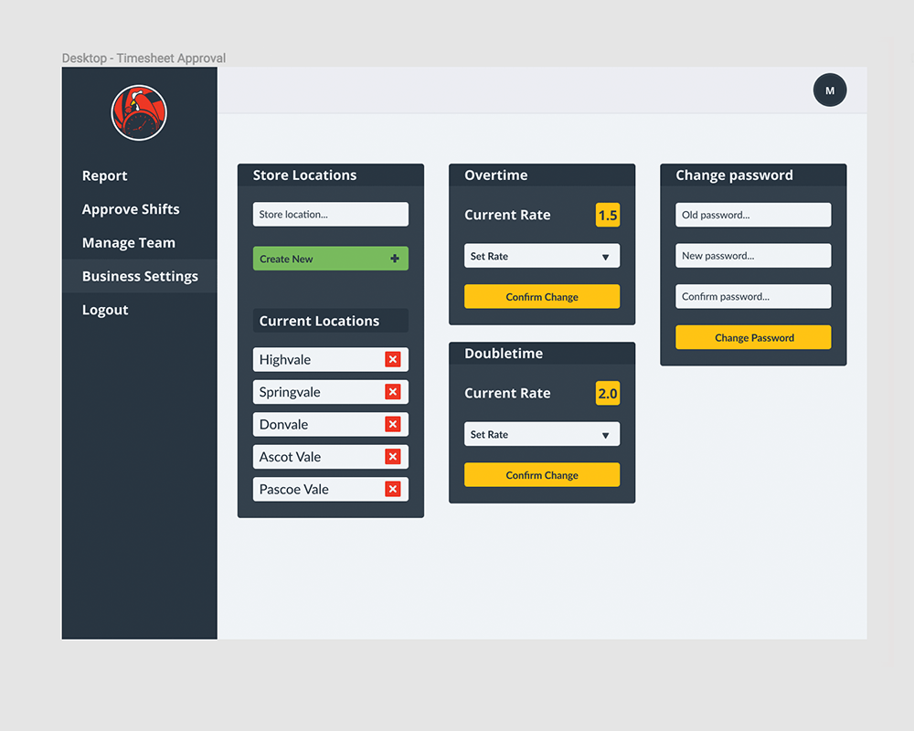</a>

<br>

#### **Link to Design Wireframes on Figma**
You can find our Design Wireframes on Figma <a href="https://www.figma.com/file/E6dEYafb0SWYjyU57uw4HRga/Chicken-in-Design">HERE</a> 
<br>

## **Entity Relationship Diagram**

Given the nature of the Data, we have 4 mongodb Schemas for use in our app: `Employee`, `Manager`, `Shift`, and `Business`.

> -**Employee**  
> - id: String (Auto generated by mongoose)
> - firstName: String
> - lastName: String
> - fullName: String
> - email: String
> - password: String (hashed and salted value)
> - location: [ array of Strings ]
> - standardRate: Number (cents)
> - business [ references `business` `id` ]
> - status: Boolean (default: true) (for tracking employee status)

`employee` has no references. Their `location` is an array, selected on the frontend by pulling in the available options from `business`

> -**Manager**  
> - id: String (Auto generated by mongoose)
> - email: String
> - password: String (hashed and salted value)
> - business: [ references `business` `id` ]

`business` references the ID of `business`, tying the manager to the business

> -**Shift**  
> - id: String (Auto generated by mongoose)
> - employee: [ references `employee` `id` ]
> - date: Date
> - location: [ Array of Strings ]
> - startTime: Number
> - endTime: Number
> - standardMinutes: Number
> - overtimeMinutes: Number
> - doubleTimeMinutes: Number
> - totalPay: Number (cents)
> - status: String ('pending', 'approved', 'rejected', 'archived')
> - business: [ references `business` `id` ]

`employee` references the ID of `employee`, as each shift is owned by an employee

> -**Business**  
> - id: String (Auto generated by mongoose)
> - name: String
> - address: String
> - location: [ Array of Strings ]
> - overtimeMultiplier: Number
> - doubleTimeMultiplier: Number

## **Project Architecture**

<a href="./docs/part-b/images/architecture.jpg" target="_blank"></a>

(Initial ideation / decision making process for our 3-app system, and other ideas)

## **Overview:**

```

/
-- /backend/
       /models/
           /Employee.js
           /Manager.js
           /Shifts.js
           /Business.js
       /routes/                              ## routes start here for each 
           /authRouter.js                    ## /api/route/ namespace
           /employeeRouter.js   
           /...etc                                      
       /controllers/                         ## ...and refer to 'controllers' 
           /employeeRouter.js                ## for their methods/logic
           /...etc                                  
       /middleware/
           /authMiddleware.js
           /logger.js
           /...etc
       /tests/
           /unit/
              /example.test.js
           /integration/
              /example.test.js
           /route/
              /example.test.js
       server.js                             ## Server Entry Point

-- /frontend/
      /dist/                                 ## webpack bundled production files
      /src/
          /employeeApp/
              /dashboardPage/
                  /exampleComponent/
                      exampleComponent.js
                      exampleComponent.scss
              /router/                       ## Shared Components live in router
                  /exampleComponent/
                      exampleComponent.js
                      exampleComponent.scss
                  /AppRouter.js              ## Main React Entry Point
              /settingsPage/
                  ## components go here
              /index.html                    ## Entry Point served by backend              
              /index.js
              /styles.scss                   ## Overall Page styles
          /managerApp/
              ## Same structure as above
          /guestApp/
              ## Same structure as above
          /img/
          /tests/

-- /node_modules/
-- /package.json
-- /README.md
-- /webpack.config.js
-- (other files ie .gitignore, .eslint.rc etc etc)
```

The overarching Architecture of our App is that it sits on one NodeJS Express App Backend, which serves 3 smaller React 'apps' in separate index.js entry points.

All of these higher level components live in the same root folder structure under their own subfolders- with the package.lock and node_modules in the root- able to run the entire app with `npm run start` (and other dev commands).

This single-backend containing multiple-frontends approach allows for the entire app to be easily containerized and to have all our apps run from the same root using `npm run` commands. Each frontend app will be able to be dev served using `npm run <app name>` for development purposes.

## **Additional Architecture Information** 

You can read all about our Design and Architecture decisions in our initial Part A Design Docs <a href="https://github.com/oheydrew/ca-term3project-docs" target="_blank">HERE</a>

<br>

----
<br> 

# **Project Management**
<a href="./docs/part-b/images/project-divider1.png" target="_blank">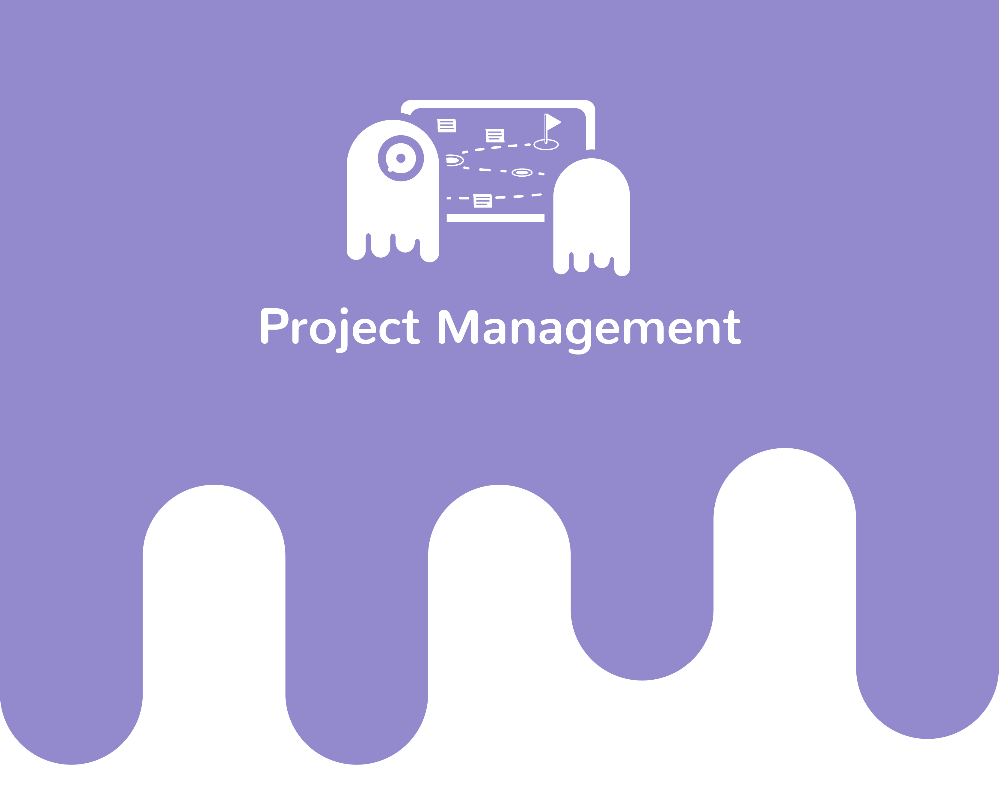</a>

## **Client Meetings**

We had five formal mettings with our client:

1. Thursday, 5th July: This was our first formal meeting with Ed. We met to discuss the web-app's requirements, including core functionality and styling requirements. Ed gave us an overview of how he wanted the app to work, including having the ability to:
- Approve or reject shift submissions
- View a summary of all the shifts by week
- Automatically calculate the pay based on the hours worked and day worked
- Add or remove employees from the system

  We also proposed some ideas, including developing for mobile first, and creating a user-friendly interface for his employees. We went back-and-forth discussing these requirements for about an hour. At that point, we decided we had enough information to develop a basic wireframe so we ended the metting and arranged to meet early next week to discuss our draft wireframe.

2. Tuesday 10th July: We met for approximately 30 minutes to discuss the draft wireframe that we had put together. The wireframe included all the core functionality that we discussed the previous week, but did not have all the styling completed. After some discussion, Ed was happy with the functionality we proposed and didn't ask for any major changes. We ended the meeting and arranged to meet again after the wireframes were fully styled.

3. Friday, 13th July: We met for about 20 minutes to discuss the fully styled wireframes. Ed didn't have any preference for the styling or branding, so this was his first time seeing what we had in mind for styling. He liked the logo and color scheme so didn't propose any major styling changes. Now that he could visualize the final app, he was quite excited about it.

4. Friday, 20th July: We met for an hour to show Ed the progress we had made. We had built the functionality for most of the pages, but a lot of the styling work still needed to be done. Ed was a little concernend that there wasn't enough time to finish the app, so he proposed to reduce some of the functionality. We tried to assure him that even though it looked rough, a lot of the functionality had already been done and that we would have enough time to finish the whole thing. Ed tested some of the functionality and made some recommendations about how the filtering and sorting should work. We agreed to change to functionality to align with what he wanted.

5. Wednesday, 25th July: By this stage, we had finished 95% of the app's functionality and styling. We met with Ed to show him the app, and he was impressed with what we had done. We walked him through various aspects of the app, and he tested out some of the functionality as we went along. He was happy with how everything worked, and was glad that it worked on his mobile phone. Afterwards, we discussed next steps, inducing deployment, data and ongoing maintenance. Ed told us he would continue to maintain the app with the help of his nephew, who is a web developer. We told him we would hand over our project to him on Friday, after we finished our presentation.
<br>

## **Information Gathering and Competitor Analysis**

When tackling this opportunity, our team wanted to develop a lightweight shift tracking app, that merged user centric design with the MERN for intuative communication between the front and backend codebase.

#### **Competitor Analysis**

While a competitive marketplace, we found that a disproportionate number of employee and shift management services offered online are built ontop of models with a high barrier of entry for small to medium sized businesses, such as our clients.

In addition to varying financial costs, users are forced to make the choice between larger companies, which can offer customisation, and smaller companies, which while leaner and easier to use, lack the ability to be tailored to their business.


<a href="./docs/part-b/images/comp_analysis.png" target="_blank">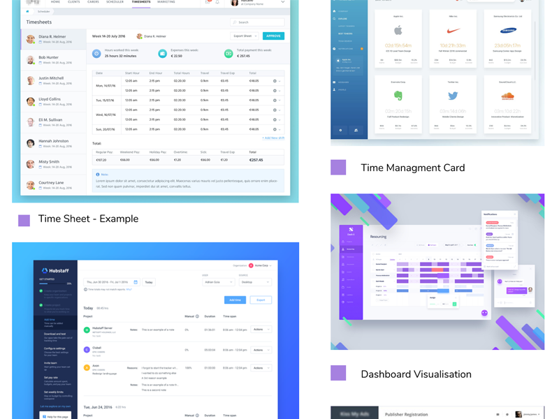</a>

#### **Branding Development**

Identify colour trends and flat designs in competing businesses, we were able to develop a visual identity for our clients app to create a sense modernity while complementing the brands heritage (see bottom right).

<a href="./docs/part-b/images/branding_dev.png" target="_blank">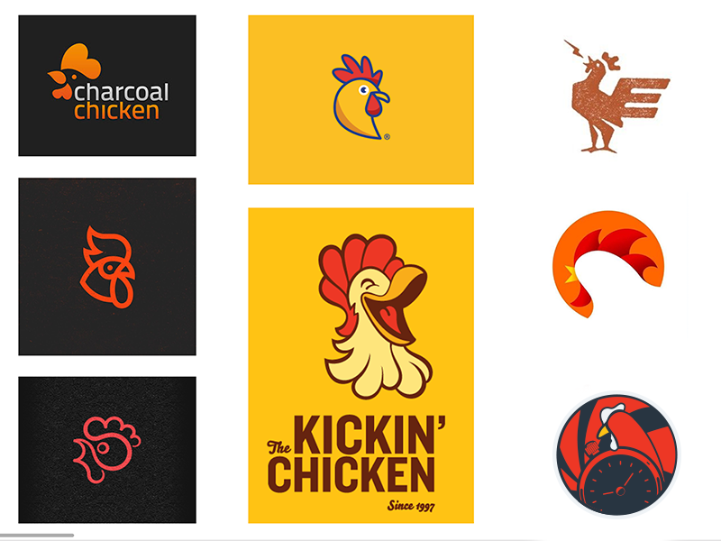</a>

#### **Color Development**

When picking colours, our aim was to use contrast to our advantage to direct the user's attention towards import buttons and visually guide them through in-app processes.

<a href="./docs/part-b/images/color_development.png" target="_blank">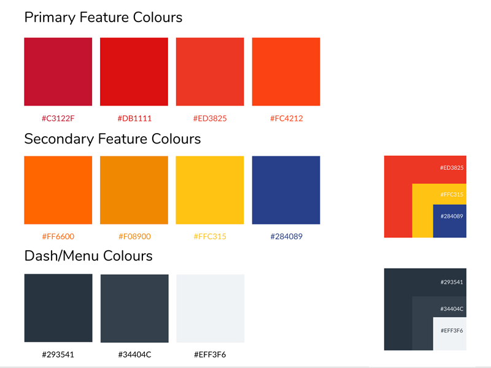</a>

<br>

## **Planning and Scope**

To ensure we stayed on track, our team implemented a series of system, from agile methodologies to project management apps, to ensure we kept to our project timeline. 

Initial Projections had the core planning stages to be completed within the first week and second week would be attributed to the brunt of the codebase.

In conjunction with Trello, we also utilised timeline app create by one of our own <a href="https://github.com/maxitron93/">team</a> for our initial build. Below you can see the main legs for our stages of development.

#### **Initial Timeline**

<a href="./docs/part-b/images/initial-timeline.png" target="_blank"></a>

#### **Final Timeline**

<a href="./docs/part-b/images/final-timeline.png" target="_blank">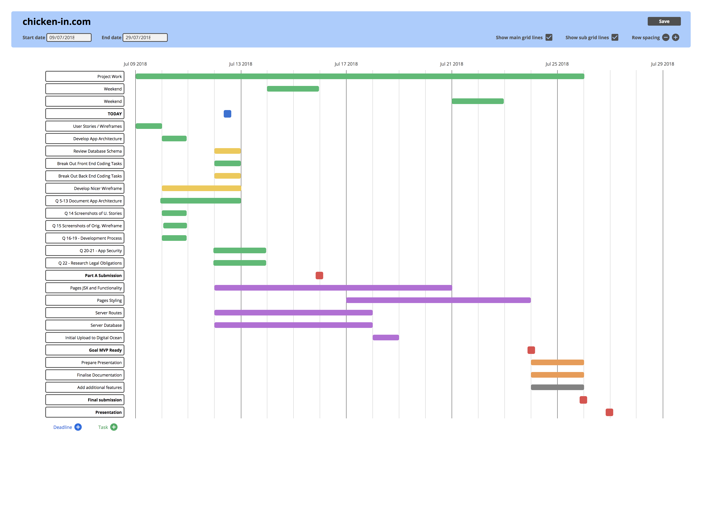</a>

We got in and moving on our project timeline really early. We actually got to use one of Maxi's previous projects, a timeline tracking app, to lay out and timeline our journey.

We initially just planned out the design phase for week one, starting with ideation and moving right through to design work. 

We reassessed at week 2, plotting out our planned course for the development phase of the app. This began with skeleton structure of the entire app, and then broke out into fleshing out both back and front-end sections.

We were happy to see that for the most part, we kept on schedule or sooner! Using our Trello board in combination with the timeline we were able to keep our heads and feel good about the journey.
 
<br>

## **Team Management**

<a href="./docs/part-b/images/team-intro2.png" target="_blank">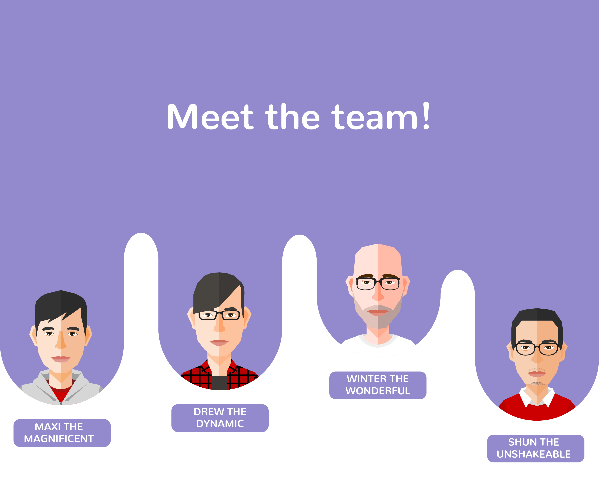</a>

<a href="https://github.com/maxitron93/">Maxi</a> | <a href="https://github.com/oheydrew">Drew</a> | <a href="https://github.com/mcwinter07">Winter</a> | <a href="https://github.com/shunichiroid">Shun</a>

While we were fortunate to have a diverse array of proficiencies within our team, we decided that as this was primarily a learning experience for us as junior developers, we would not pigeon hole any indivudal into a single front or backend task.

Instead we devided our work through feature and each were individually responsible for the front or backend logic ascociated.

When it came to breaking out individual tasks and allocations, we decided instead to work on an Agile model, breaking down the work into cards, organising the cards at regular intervals, and then breaking out into sections we felt we could achieve, or wanted to work on. 

As a high level overview, we ended up seeing everybody working well together on everything, but in particular, we saw the team working on:

- **Maxi** : 
    - Webpack and Front-end Design Structure 
    - Deployment and Production Environment 
    - Backend Controller Logic, Routes, Models
    - Front-End React Pages in Guest, Employee, and Manager
    - CSS Styling
    - ...And more!

- **Drew** : 
    - Back End Design and Structure
    - Backend Routes Logic, Models
    - Git Workflow and Github oversight
    - Scrum Board Management
    - Front-End React Pages in Manager
    - Testing, Development and Production Environment Setup
    - Basic Intergration Testing
    - ...And more!

- **Winter** : 
    - Layout, Component and App Visual Design
    - Component Design and CSS
    - Backend Routes Logic, Models
    - Front-End React Pages in Guest and Manager
    - CSS Styling
    - ...And more!

- **Shun** :
    - Front-End Logic for Filter methods
    - Front-End Logic for Sorting methods
    - Employee Management React Front-End
    - Backend Routes Logic, Models
    - CSS Styling
    - ...And more!

### **Self Assessment & Pain points**

#### **Maxi**

>Most of my pain points came around deployment. Whilst we did set up the ability to work in development and production modes, avoiding the need to build with webpack for every single small edit, having to switch between the two at production time was a definite hassle. We would do that differently next time.
>Having to run build and reset pm2 every time we wanted to deploy was also a bit of a pain...I'm sure there's a more streamlined way to do it than the way we did implemented it.
>Dealing with changing requirements from the client added challenges, and as the main point of contact I experienced the brunt of this. I found it a big challenge in the midst of a 2 week assignment, as interesting as it was.

#### **Drew**

>I loved getting in and getting this done. I found myself immediately drawn to the project management and team organization aspects of working in a team of coders- and threw myself into git, github, trello and all of those things. Git is an interesting challenge, and we had a few stumbles early on, but mostly corrected them by sticking to our git workflow.
>
>Project Scope was probably the biggest challenge. It wasn't far in that I realised how much we had to achieve. As a result, we had to opt out of TDD (time didn't seem to allow for it), and that was a real shame, to me. If I could do over, I'd choose a smaller project, and full test it as I go.
>
>I struggled with React State, a little, early on- but I ended up learning more about React in this project than in the entirety of my prior learning. By the end of it, I had a great understanding of how that all works, and I'm keen to expand my knowledge into Redux, etc.
>
>I had some challenges with Route and Model testing, so much so that I had to leave the work half-finished by the end. This was a shame, but given the scope of the project I had to let it slide in order to get the core app functionality right. The little testing I did do, brought to light some issues immediately which we were able to resolve. The next project I work on will be Tested From The Start!

#### **Winter**

>The greatest challenge I personally encountered in this project was handling the axios request and linking front-end logic to our applications database.
>
>While focussing largely on front-end development in this project, this was an area that I actively sought to hone. From this, I garnered a greater appreciation and understanding of back-end logic, database architecture and how to effectively interpret other developers code.

#### **Shun**

> - Guest app front-end
>   - Change states by user input (Manager/Employee)
>
> - Manager app manage-employee page front-end 
>   - Create modal(react-modal)
>   - Styling grid on modal
>   - Implement sorting function for employee cards 
>   - Display previous states on edit employee form modal
>   - Display/hide location checkbox in form modal
>   - Link employee data to backend by axios and lifecycle methods    


## **Agile Methodology**

**[Main Scrum Trello Board](https://trello.com/b/DFlgggpu)**

Task tracking and breaking out tasks to individual features was really important to our team dynamic. Early on, we had very frank and open discussions about the fact that we had a diverse team, with varying levels of time outside of class and confidence in abilities. We decided to work hard to implement agile practices and break down tasks into achievable chunks, so as to best work together to achieve our goals.

To that end, from the outset we implemented a main Scrum-style Trello board, split into a number of sections:

<a href="docs/part-b/images/scrumboard.png" target="_blank">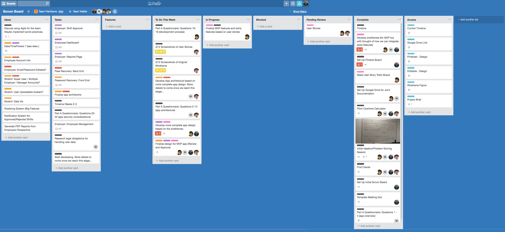</a>

Link To **[Main Scrum Trello Board](https://trello.com/b/DFlgggpu)**

**Ideas / Stretch Goals**
> All our ideas started here - straight from our very first planning session after our initial client brief. New ideas land here first, are discussed and formed if agreed to, where they move to “Tasks”.

**Tasks**
> All our main work starts here, first. ‘Tasks’ are usually larger chunks of work, including documentation, planning, and research as well as the obvious “App Feature” tasks. If necessary (mostly during development), these Tasks will be broken down into smaller “Features”, where they can be worked on by individuals. An example might be “User System (Model, Login, Logout, Auth)”

**Features**
> Mostly used in the Development stage, “Features” are generally front or back-end pieces of code, that come together to make one functional piece of the App. An example might be “Frontend: User Login Form”

**To-Do (Next Few Days)**
> The title is fairly self-explanatory, this is just a staging area for us to further breakdown our workflow. From here, we’ll decide at standup meetings who is going to work on which card.

**In Progress**
> Self-explanatory- This is where we’ll hold the cards we’re currently working on. No card gets here without assigning a team member to it.

**Blocked**
> If something is holding us up from work, we put the card here, and comment as to what the blocker is. The intention here is for us to help one another overcome the blockage, or rethink the card scope or timing.

**Pending Review**
> Somewhere to put cards if we need another team member to check on the work or review the code.

**Completed**
> Completed cards go here! Yay! 

**Access / Resources**
> A collection of links we can use to quickly get around.

The board was designed to be self-documenting, and make sense, so as not to be too confusing. We decided against using many, smaller boards, in favour of one large board, where we can follow a card from original idea through to completion.

<br>
<br>

## Agile Methodology

From the outset of this project, we decided to take a lot from the Agile methodology. Given that each of us has our own unique strengths, we have embraced the idea that we will be far more powerful as a team, and the Agile (Specifically, Scrum) practices offer a lot in the way of organization. 

### Agile Practices Included:
- Scrum Board (See Scrum section for breakdown)
- StandUp Meetings
- Ideation sessions (multiple for design, architecture, initial planning)
- Review (Retro)
- Code Reviews

### Ideation
<a href="docs/part-b/images/ideation.jpg" target="_blank">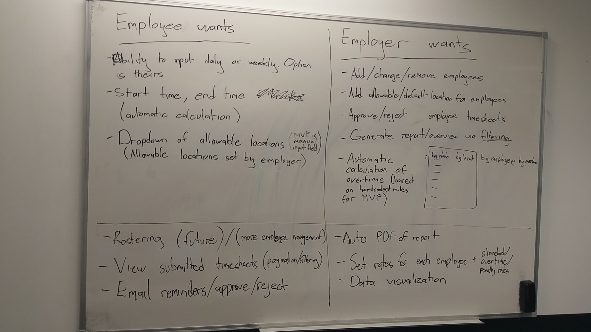</a>

We kicked it off with a big Ideation whiteboard session. This was great in laying out what we needed and wanted to achieve given the client’s needs. Further meetings were had later in this vein for the Architecture section, and again for Design. Iterations continued with each meeting, and the product started to take form. From this, we started up our Trello board “Ideas” column, and the flow progressed from there.

<a href="docs/part-b/images/ideation2.jpg" target="_blank">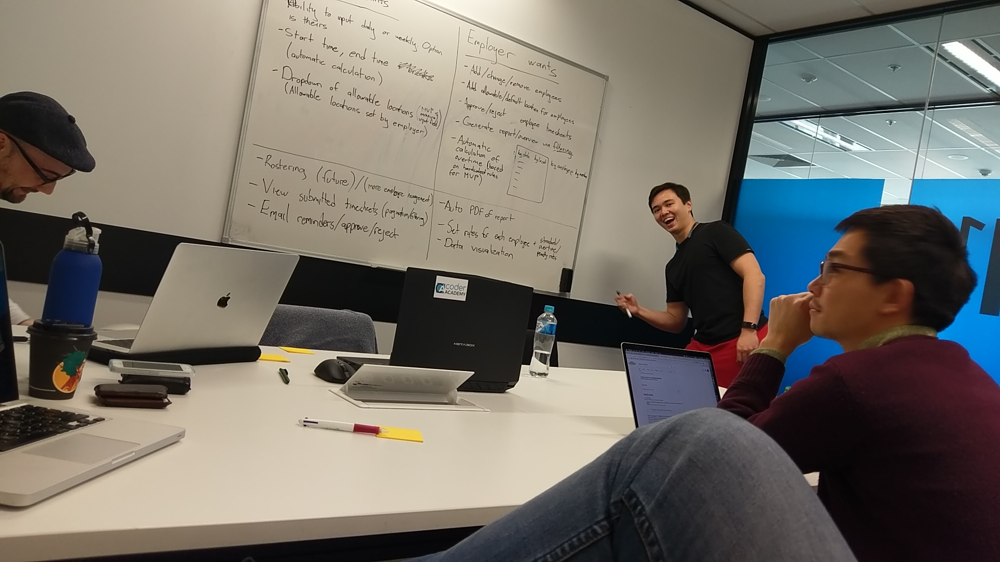</a> <a href="docs/part-b/images/postit.jpg" target="_blank">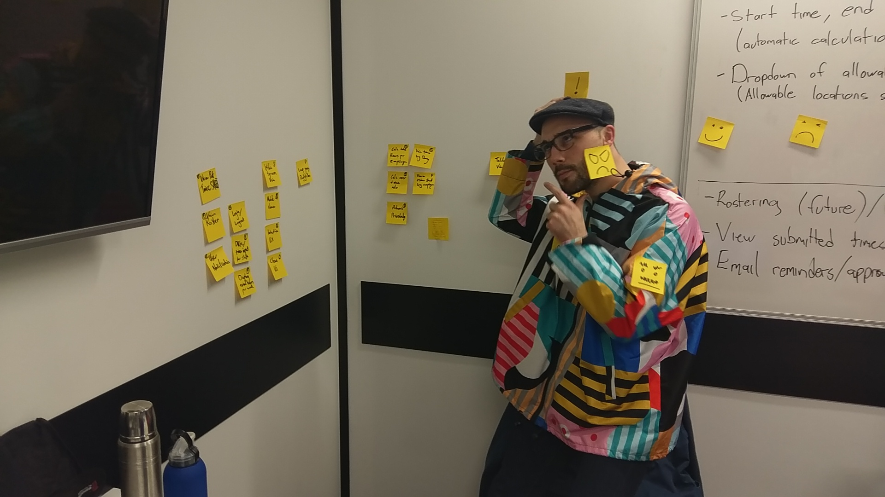</a>
<a href="./docs/part-b/images/nab_stand_up.jpg" target="_blank"></a>

(We also had fun. Winter got *really* into his post-it notes :D)

### StandUps
We also agreed to daily stand-ups, so as to get one another on the same page as far as what we’re all working on. We had some big conversations about our plans to break down tasks and work together. We all agreed that whilst it’s important to lean on our strengths, nobody should have to feel as if they are “Carrying” any aspect of the project - from design, through to code. To this end, regular stand-ups, and breaking things down into achievable chunks were very important to all of us. 

### Blocked / Review
Adding in a “Blocked” step to the scrum board was another big part of this. We agreed that if something’s holding us up, we can park the card here and move on to something else, after notifying the team or finding someone to help. We plan to hold weekly reviews- Perhaps not full “retrospectives”, as we may not have time, but at the very least borrow from the “safe, blameless space” ethos while holding these reviews.  

## **Code review**

Our process was handled largely through Trello, with each completed being sent to our "Pending Review" list prior to deployment. 

If a feature/page/branch encountered an error that could not be immediately fixed, a member of our team would place it in the "Blocked" column. This signalled for one or more team members to jump on the issue and try to find a solution.

We used annotations and `TODO:` lists in code to identify problem areas or necessary fixes.

<a href="./docs/part-b/images/code_review2.png" target="_blank">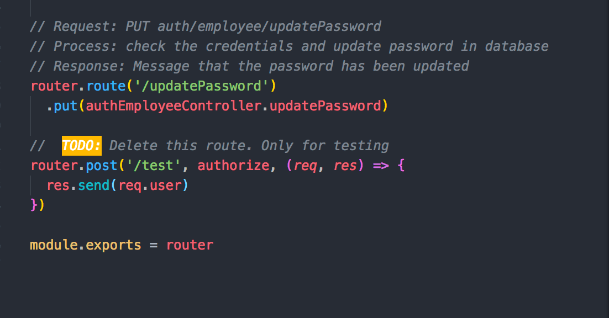</a>


<a href="./docs/part-b/images/code_review1.jpg" target="_blank"></a>


## **Git Workflow**

<a href="./docs/part-b/images/git-workflow.png" target="_blank"></a>

For version and source control, we used Git, with a main repository stored on Github. We went in with production in mind, and designed the flow with a “Protected” `master` branch for pushing to production, and a `develop` development branch for working between releases. 

This actually worked out really well, allowing us to separate out our releases toward the end of our development cycle.

We have taken a lot of inspiration from this model: <a href="https://nvie.com/posts/a-successful-git-branching-model/ ">https://nvie.com/posts/a-successful-git-branching-model/ </a>

Master (Protected): The `master` branch is ‘Protected’ against any `git push` commands, and only able to be merged via Pull Request on Github. The idea behind this is that `master` is only to be used for stable releases that have been tested and checked thoroughly.

For individual features, we used separate `feature` branches cloned off of the `develop` branch. These branches will be merged into the `develop` branch, after changes are pulled and conflicts resolved. We intend to push these `feature` branches as well, to keep a record of our progress, though this isn’t really necessary for a project of this scale.

We began by pushing these smaller branches to github, but when it became clear that we'd be polluting github with over 100+ branches, we decided to keep those local.

### Git Workflow

**Creating a feature branch (Example, “Login Form”)**

**Step 1: Make sure you’re in ‘develop’**

> `git checkout develop`

**Step 2: Pull the changes from the main repo, getting you up to date**

> `git pull origin develop`

**Step 3: Create your new feature branch - This is important! Otherwise we’ll be conflicting up the wazoo on develop :P And try to name your branch smart! Use the name on the Trello card you’re working on, if possible.**

> `git checkout -b login-form develop`

> (note the ‘develop’ on the end, makes sure it creates the branch off of ‘develop’, not ‘master’)

**Step 4: Make your changes! Do your code!**

> <-- 🎉  -->

**Step 5: Add and commit your changes to your branchv

> `git add .`

> `git commit -m “A descriptive and useful commit message please!”`

**Step 6: Push your branch to github (for history's sake)**

> `git push origin login-form`

**Step 7: Change back to ‘develop’**

> `git checkout develop`

**Step 8: Do a git pull (on ‘develop’ branch) - this is to make sure that if someone else has gone ahead and pushed since you last worked on it, you’re all up to speed. *ALWAYS GIT PULL BEFORE PUSH! :D***

> `git pull -u origin develop`

> (or just `git pull` if you’ve already set your upstream)

**Step 9: Merge your branch back in (Again: Don’t forget to pull, first!)**

> `git merge --no-ff login-form develop`

**Step 10: Push your change to develop**

> `git push origin develop`

## **Client Handover and Continued Support**

We had finished about 95% of the app's functionality and styling by July 25. We met with Ed to show him the app, and he was impressed with what we had done. We walked him through various aspects of the app, and he tested out some of the functionality as we went along. He was happy with how everything worked, and was glad that it worked on his mobile phone. Afterwards, we discussed next steps, indlucing deployment, data and ongoing maintenence. Ed told us he would continue to maintain the app with the help of his nephew, who is a web developer. We told him we would hand over our project to him on Friday, after we finished our presentation.

## **Client Questionaire**

We put together a short questionaire for our client, to gauge how well they thought we completed their brief, and get feedback on the process.

>1. How satisfied are you with our app?

>2. How well did we communicate with you throughout the process?

>3. How easy do you find it to navigate through our app?

>4. How likely are you to use our app for your business?

>5. Which feature did you like the most?

>6. Which feature do you think needs the most improvement?

As of the time of submitting this documentation, we haven't heard back - but We're eager to hear back from our client about what he thinks!

## **Post Project Review**

This was a fun, but challenging project. We all had a chance to work on various aspects of the app, including both the front-end and back-end. This was the first time any of us had developed an app as a team - we had to quickly learn how to work in a team efficiently and find a balance between pushing out work and making sure people got to work on what they wanted. Overall, it was a great experoence and we became better developers because of it.

#### **Testing**

We went into this project knowing that the scope was wide. As a result, we made a decision not to use Test Driven Development, as we felt that we'd have enough challenges as juniors working out our methods, before we could test them.

As a result, a large portion of the codebase is untested- and we had to rely on fairly extensive User Testing to get by. This worked fine for us, in the end, and we did add a few basic intergration tests to see us through, but it was a shame that given the scope of the project we couldn't fully test. 

We all did see the value of testing frameworks and test coverage, though- especially toward the end of the development process. Reviewing the codebase, we can now see how much we could have benefited from having a Test First structure, as the code would end up being much more cohesive and robust.

We did use both Unit and Intergration testing, and we did all get a chance to see, and learn how that works. On our next projects we all look forward to being afforded the time to be able to take testing on.


----
<br>

# **Tools & Methodologies**
<a href="./docs/part-b/images/project-divider3.png" target="_blank">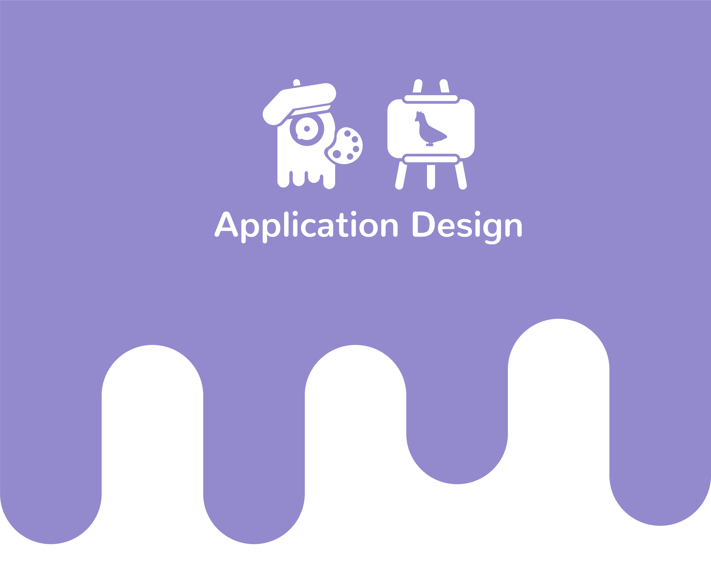</a>

## **Project Management Tools**

Given the scope and scale of the project, our team was cognizant of the need to track and monitor our progress with each stage of development. To best support the team dynamic and ensure continual development we used the following tools:

<br>

#### **Figma** 
For developing the wireframes. We had a two-stage design process- An initial group-planned mock wireframe, and then more fleshed-out "design" wireframes.

<a href="./docs/part-b/images/figma_snap.png" target="_blank">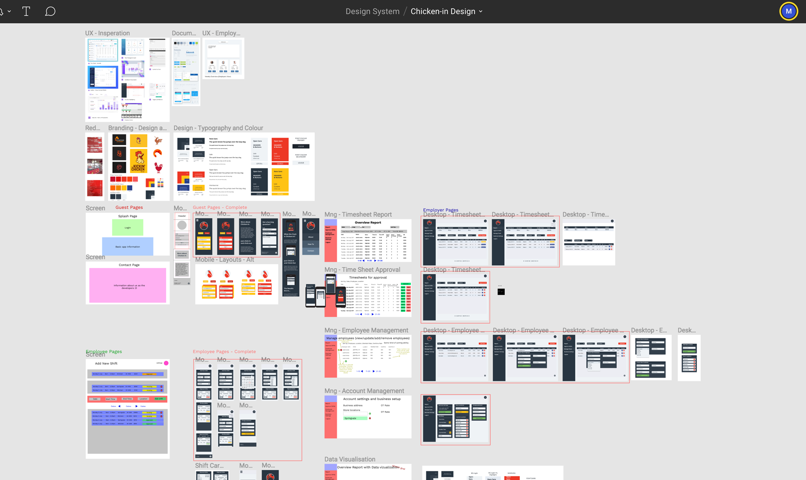</a>


#### **Trello** 
For general project management. We leaned *heavily* on this! We've multiple boards for resources and internal info, but it all flows back to our main trello board (example below).


<a href="./docs/part-b/images/trello_snap.png" target="_blank">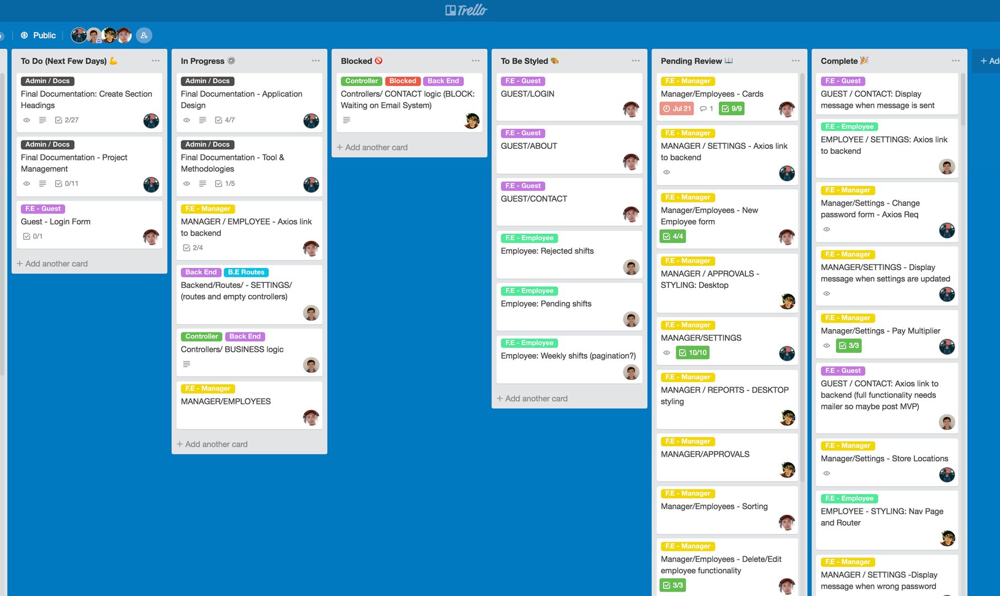</a>

<a href="https://trello.com/b/DFlgggpu/scrum-board" target="_blank">Scrum</a> board.

#### **Git** 
For version control. See below for more detail about our Git workflow.

<a href="./docs/part-b/images/gitlog_snap.png" target="_blank">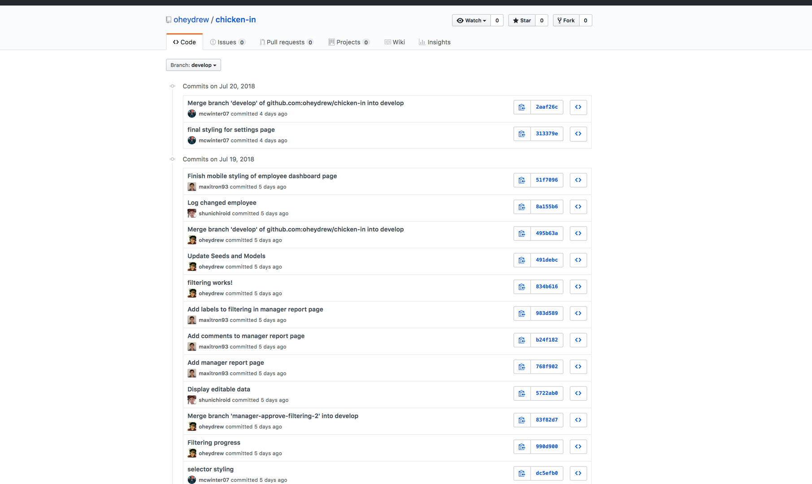</a>

<a href="./docs/part-b/images/git-workflow.png" target="_blank"></a>

<br>

# Future Development

## Features
Given the limited time-frame of our project there were several features that did not make it to production:

• Display user avatars or names on login to personalize the user experience and help managers quickly identify employees.

• Animation to create a more fluid interface and help guide and reward user interaction.

• Add additional admin status to include sub-managers with limited admin control/ dashboard control.

• "Print PDF" functionality for the Reports and Data Visualisation pages, so that the client can easily export/store data.


<br>

## Handover
In addition to features for future inclusion, our team considered several key requirements for handover and ongoing support: 

• Legiable source code and annotations to allow for future independant developemnt.

• Initial login details handed to the client.

<br>
<br>

----

## **Dev instructions**

Welcome, Nerds! We're impressed that you got this far. If you're interested in toying with our code - Here's a quick overview of what you can do to get started.

#### Required Pre Installation:

- NodeJS 8.0+ (with NPM)
- MongoDB (running on localhost, default port)

#### Clone and NPM Install

Once you've installed the necessary pre-requisites, you can go ahead and clone the repo:

`~/ $ git clone https://github.com/oheydrew/chicken-in.git`

`~/ $ cd chicken-in`

`~/chicken-in/ $ npm install`

#### To run the server in Development mode:

#### Step 1 (.env):
First, you'll need to create a `.env` file inside `/chicken-in` 's root.

`~/chicken-in/ $ touch .env`

Open this file, and add the following configuration variables:

> `.env`:
```
SERVER_PORT=3000
MONGO_URL=mongodb://localhost
MONGO_PORT=27017
MANAGER_PASSWORD='password'
EMPLOYEE_PASSWORD='password'
```

#### Step 2 (hostUrl):
Next, open up the `hostUrl.js` file, to configure it back to development mode.

`~/chicken-in/ $ cd frontend/src/`

Uncomment the `localhost:3000` line, and comment out the `undefined` line.

> `~/chicken-in/frontend/src/hostUrl.js`:
```
const hostURL = 'localhost:3000'
//const hostURL = undefined

export { hostURL }
```

#### Step 3 (Populate Mongo DB):

`~/chicken-in/ $ npm run seedData`

#### Step 4 (Backend Server):
Then, from the `~/chicken-in/` root:

`~/chicken-in/ $ npm run start:dev`

#### Step 5 (Frontend Server):

For the Guest (Login) app:
`~/chicken-in/ $ npm run guest`
For the Manager app:
`~/chicken-in/ $ npm run manager`
For the Employee app:
`~/chicken-in/ $ npm run employee`

Open chrome to `http://localhost:8080/` and you're away!

#### To build production:

You'll need to set the `hostUrl` file back to how it was when you cloned the repo.

Then: `~/chicken-in/ $ npm run build`

Run the prod server with: `~/chicken-in/ $ npm run start`

Open chrome to `http://localhost:3000/` and you're away!

<br>
<br>

----


<a href="./docs/part-b/images/team-intro.png" target="_blank">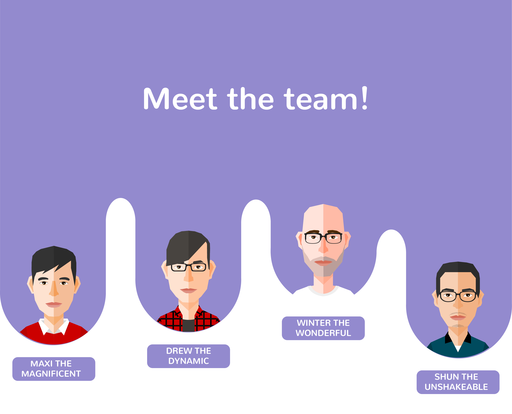</a>

Brought to you by Painframe LLC 