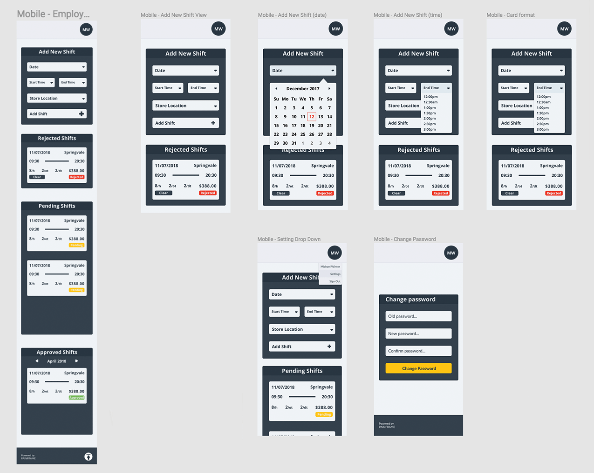
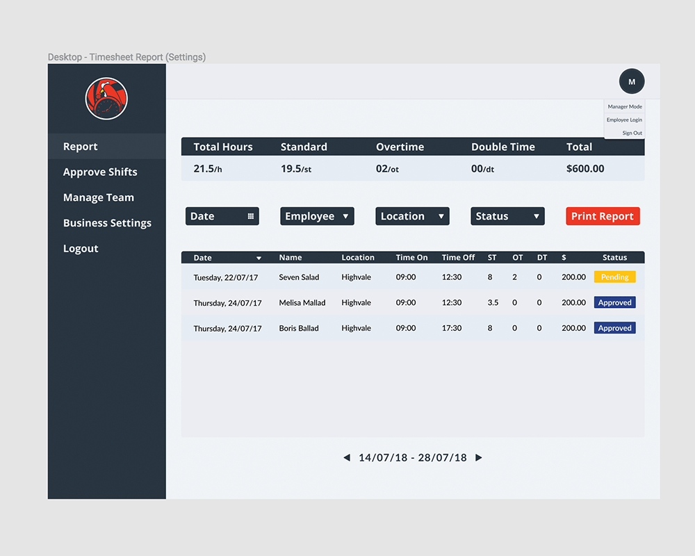
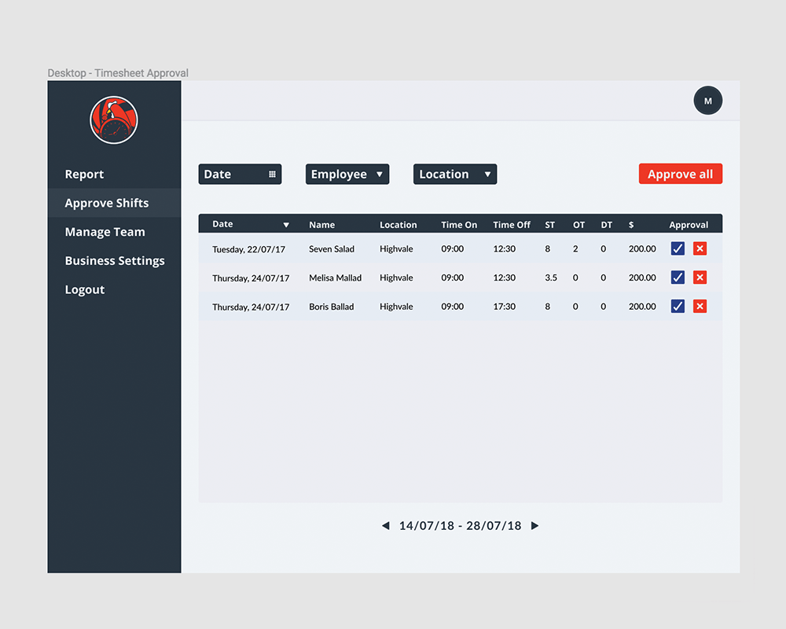
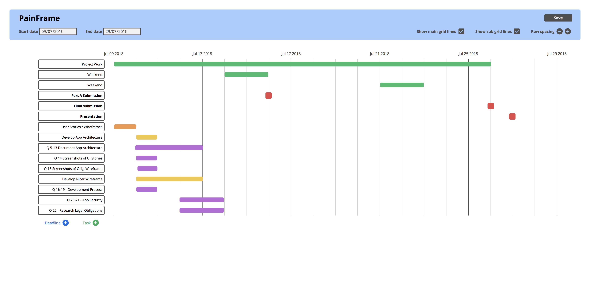

# Project Management 

## Client Meetings

Record interactions with your client in a diary format

## Information Gathering and Compeitior Analysis

Plan information gathering activities to determine project requirements, constraints and risks

## Project Scope

Develop project charter, including preliminary statement of project scope and obtain sign-off

## Project Timeline

Prepare project work breakdown and schedule

##  Project Management

Allocate roles and responsibilities to team members, based on project solution requirements

## Sequencial Self Assessment

Monitor each other’s assigned work

Reassess ongoing project scope changes, risks and issues

## Handover and Continued Support

Manage system testing and hand over activities. Prepare maintenance or support plans for client

## Ready for Deployement

Obtain final project sign-off

## Post Project Review

As a team, conduct post project review

## Client Questionaire

Create a questionnaire for the client to ascertain the satisfaction with your products and services

 

# Application Design 

## **The Client Brief**

#### **The Client**

The client for this project, owns and operates a number of charcoal chicken shops around Victoria, under the brand name “Red Rocks Charcoal Chicken”. He splits majority of his time between working in the stores as a manager and performing the administrative/entrepreneurial activities as the owner.

#### **The Problem**

One of our client's most significant challenges is keeping track of employee hours worked, calculating overtime and calculating how much he owes in wages to each employee. Currently, his employees record how many hours they’ve worked on a paper form, and he manually updates his excel spreadsheet at the end of the week. It’s time-consuming work, and his employees often make mistakes which means he has to follow up with each employee if there are any discrepancies in the shifts they've logged.

#### **The Solution**

Our original proposal was an overtime calculator - a small app that would help the client track of weekly hours worked by his staff, and automatically calculate the number of overtime hours. This concept grew to include both a manager and employee logins, to enable real-time tracking and input of total hours, dates and overtime rates with every shift.

#### **Employee Functionality**

Addressing a key consideration from our client, we decided to implement a mobile-first approach for the employee facing app, where each user is able to log in, enter, track, and view the total standard/overtime/double time hours of each shift input. 

We found that this stripped back interface would best serve the needs of the client's team, who found their paper-based system inefficient and time-consuming.

#### **Manager Functionality**

On successful manager login, the user is redirected to the manager dashboard, where they have access to several core functions of the app.

Managers will be able to view weekly shift reports, approve or reject pending shifts, manage their teams stores and configure their business settings.

After our initial meeting with the client, our team decided that we could not integrate mobile-first design for the manager dashboard without sacrificing the ability to display and easily read shift data. As such, the manager dashboard focused on desktop functionality, with mobile-driven design benched as a stretch goal.

 

## **Concept Review** {X}

Review the conceptual design with the client and edit based on their feedback

## **User Stories**

We focussed on providing a number of basic user profiles based on the types of users we are likely to encounter. Using Trello, we populated a number of users, with common wants and insights gain from our meetings with the client:

 

You find the full list of our insights and user stories <a href="https://trello.com/b/1kl5tgnk">here</a>...

 

## **User Journey** {X}

A workflow diagram of the user journey's

 

## **Wireframes and UX**

To create our intial wireframe we used the insights gained through our user stories to rapidly prototype our apps features and general design. From there, we moved on to more specific design wireframes, which can be seen below:

#### **Guest Pages**

We decided to implement a mobile-first design for our guest and employee login pages as they would be the most frequent users of the Chicken-in Web app. The single page design allows the users to rapidly digest the purpose of the app with a summary of its full functionality in the about section.

 

 

#### **Employee View**

Iterating on the single page design, Red Rocks employees are redirected to a lightweight rostering app with the immediate ability to add and review past/pending/rejected shifts.

 

 

#### **Manager Reports**

On this page, the manager is given an overview of the weekly shifts that have been approved or are pending approval. A stretch goal is to integrate a "print report" function that produces a print ready pdf for physical documentation. An additional consideration is to include data visualisation within this dashboard further support the reporting functionality.

 

 

#### **Manager Approvals**

On this page, managers have the ability to view all pending shifts input from employees and approve/reject them. Stretch goals are to include a comment popup when rejecting a shift to give further clarification to an employee as to why the shift has been denied.

 

 

#### **Manager Team Management**

We decided that a full-scale HR app that stored and protected large amounts of employee data was not necessary for our client scale. Designed for ease of use, we kept the interface lean, with the ability to quickly edit, remove (archive), and add new employees within one view.

 

 

#### **Manager Settings**

Rather than hard code the values for overtime and double time, we decided to give our client the option to change the multiplier according to the current award rate in hospitality, as this is prone to change.

 

 

#### Link to **<a href="https://www.figma.com/file/E6dEYafb0SWYjyU57uw4HRga/Chicken-in-Design">Design Wireframes on Figma</a>**

## **Entity Relationship Diagram** {X}

Need: ERD

## **Planning and Implementation**

To ensure we stayed on track, our team implemented a series of system, from agile methodologies to project management apps, to ensure we kept to our project timeline. 

Initial Projections had the core planning stages to be completed within the first week and second week would be attributed to the brunt of the codebase.

In conjunction with Trello, we also utilised timeline app create by one of our own <a href="https://github.com/maxitron93/">team</a> for our initial build. Below you can see the main legs for our stages of development.

 

#### **Initial Timeline**

 

#### **Final Timeline**

 

# Tools & Methodologies 

## Project Management Tools

Trello or similar project management tool to be used for Kanban process to track progress of build

## GitFlow

GitHub Demonstrate use of frequent commits, feature branches (based on user stories), pull requests and merges

## Agile First

Use Agile development methodologies

## Code review

Demonstrate that you have had your code reviewed by other students and that you have provided a code review for others

## Show evidence of client communication, e.g. meeting minutes, emails, or other communication tools

 

# Technologies

## Mongo / Mongoose

## Express

## React.js

## Node.js